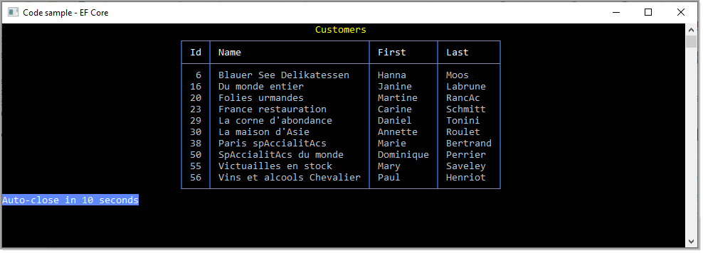

# About

Basic starter to work with Entity Framework Core in a console application.



# NuGet packages

- [ConfigurationLibrary](https://www.nuget.org/packages/ConfigurationLibrary/)
- [Spectre.Console](https://www.nuget.org/packages/Spectre.Console/0.44.1-preview.0.17)
- [Microsoft.EntityFrameworkCore.SqlServer](https://www.nuget.org/packages/Microsoft.EntityFrameworkCore.SqlServer/5.0.9)


# Simple code

```csharp
using System.Linq;
using EntityFrameworkStarter.Data;
using Microsoft.EntityFrameworkCore;
using Spectre.Console;

namespace EntityFrameworkStarter.Classes
{
    public class CustomerOperations
    {
        public static void ListWithContacts()
        {
            var table = new Table()
                .RoundedBorder()
                .AddColumn("[b]Id[/]")
                .AddColumn("[b]Name[/]")
                .AddColumn("[b]First[/]")
                .AddColumn("[b]Last[/]")
                .Alignment(Justify.Center)
                .BorderColor(Color.LightSlateGrey)
                .Title("[yellow]Customers[/]");

            table.Columns[0].Alignment(Justify.Right);

            using (var context = new NorthwindContext())
            {
                var customers = context
                    .Customers
                    .Include(customer => customer.Contact)
                    .Where(customer => customer.CountryIdentifier == 8)
                    .ToList();

                foreach (var customer in customers)
                {
                    table.AddRow(
                        customer.CustomerIdentifier.ToString(), 
                        customer.CompanyName, 
                        customer.Contact.FirstName, 
                        customer.Contact.LastName);
                }
            }

            AnsiConsole.Write(table);

        }
    }
}

```