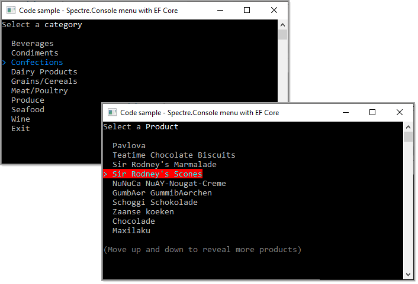
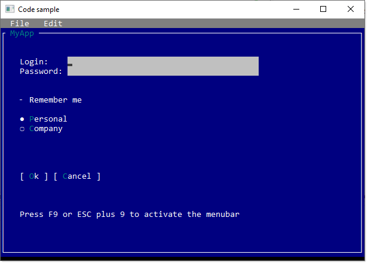
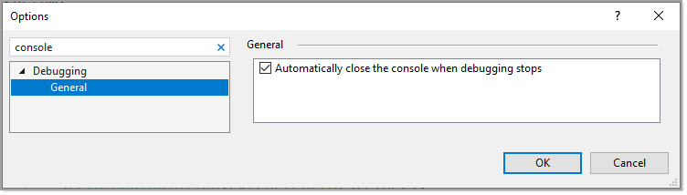

# Working with console applications .NET Core

Developers when first starting out learning C# tend to forget to first learn the basics of the language. The best way to learn the basics is to start off with using console projects as they circumvent the need to learn how to work with user interfaces such as with web or desktop projects.

Here are various examples for learning how to code in C# along with basic to advance code samples for prompting users for information and how to create simple to complex menu systems.

**Simple menu**

**Roboust menu**

## Requires

- Visual Studio 2019 or higher
- .NET Core 5 or higher

## Close or dont close on exit

Under Tools, options

