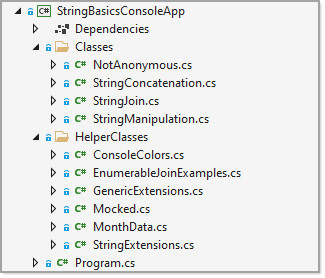

# Working with console applications .NET Core

Developers when first starting out learning C# tend to forget to first learn the basics of the language. The best way to learn the basics is to start off with using console projects as they circumvent the need to learn how to work with user interfaces such as with web or desktop projects.

When learning the basics a good place to start is learning about structuring a project. Do not place all code into the program class which is the main entry point for console projects.

In the screenshot below code logic is placed into classes and the classes are placed into folders. Note that both folders and class names should be meaningful names so when looking at them without opening a file you have a decent idea what the folder holds and what the file use is.

Here are various examples for learning how to code in C# along with basic to advance code samples for prompting users for information and how to create simple to complex menu systems.

**Simple menu**

**Roboust menu**

## Requires

- Visual Studio 2019 or higher
- .NET Core 5 or higher

## Close or dont close on exit

Under Tools, options

